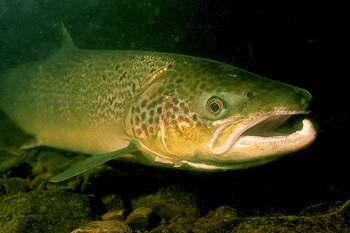

## What is a Seawolf?? 

The Seawolf or (wolf fish) is a genus of fish that lives in the Oceans of our planet. There are several wolf fish 
species that have evolved, each with their own unique traits. Information about the species and where they reside can 
be found in Table 1.1 below. 

| Species           | Environment                            |
|-------------------|----------------------------------------|
| Atlantic Wolffish | Atlantic Ocean along coastal regions   |
| Spotted Wolffish  | Atlantic Ocean - Near Russia and Canada |
| Northern Wolffish | North Atlantic and Arctic Oceans       |     
| Bearing Wolffish  | Bearing Strait                         |

I picked the wolf fish because it is actually the mascot of the university I attended for 
my undergraduate degree, Stony Brook University. Although the mascot isn't exactly a fish, it bears the same name as 
the sea wolf, or wolf fish. 

Some fun facts about the wolfish: 

- Certain species contain an antifreeze derivative in their blood to be able to thrive in colder waters. 
- They can reach up to 2 meters in length
- Although the fangs look scary they are actually not for hunting other fish (or people). They are actually for breaking open mollusks and crustaceans. 
- They can live for over 12 years and can mate for life

Potential Food for the Seawolf that is much more pretty. (not actually food for the seawolf)

| Species         | Environment                               |
|-----------------|-------------------------------------------|
| Atlantic Salmon | Atlantic Ocean and Landlocked Tributaries |

The Atlantic Salmon was extinct in the Rhine but has returned since 1990 and evidence of spawning in the Black Forest in 2005
The Salmon is highly endangered is protected under the EU Habitat Directive. Major reasons for the decrease in numbers is the addition of structures and channelization elements 
in the Rhine. Other reasons are the poor water quality from drainage and historical pollution.  

Source:[A-Z Animals Website](https://a-z-animals.com/animals/wolffish/#single-animal-text)

Source:[NOAA Fisheries Website](https://www.fisheries.noaa.gov/species/atlantic-wolffish)

